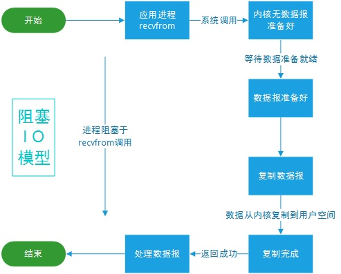

# 内存映射文件原理


- 参考文章：https://blog.csdn.net/mg0832058/article/details/5890688
- 参考文章：https://blog.csdn.net/weixin_30493401/article/details/98248565?depth_1-utm_source=distribute.pc_relevant_right.none-task&utm_source=distribute.pc_relevant_right.none-task


```
     void *mmap(void *start, size_t length, int prot, int flags, int fd, off_t offset);
```
> 进程在用户空间调用库函数mmap, 在当前进程的虚拟地址空间中，寻找一段空闲的满足要求的连续的虚拟地址ptr。这样以后，进程无需再调用read或write对文件进行读写，而只需要通过ptr就能够操作文件。
- 但是ptr所指向的是一个逻辑地址，要操作其中的数据，必须通过MMU将逻辑地址转换成物理地址，如图1中过程2所示。这个过程与内存映射无关。
- 建立内存映射并没有实际拷贝数据，这时，MMU在地址映射表中是无法找到与ptr相对应的物理地址的，也就是MMU失败，将产生一个缺页中断。
- 缺页中断的中断响应函数会在swap中寻找相对应的页面，如果找不到（也就是该文件从来没有被读入内存的情况），则会通过mmap()建立的映射关系，从硬盘上将文件读取到物理内存中，如图1中过程3所示。这个过程与内存映射无关。
- 如果在拷贝数据时，发现物理内存不够用，则会通过虚拟内存机制（swap）将暂时不用的物理页面交换到硬盘上，如图1中过程4所示。这个过程也与内存映射无关。

- __通过内存映射的方法访问硬盘上的文件，效率要比read和write系统调用高。read()是系统调用，其中进行了数据拷贝，它首先将文件内容从硬盘拷贝到内核空间的一个缓冲区，然后再将这些数据拷贝到用户空间。在这个过程中，实际上完成了两次数据拷贝。而mmap()也是系统调用，mmap()中没有进行数据拷贝，真正的数据拷贝是在缺页中断处理时进行的，由于mmap()将文件直接映射到用户空间，所以中断处理函数根据这个映射关系，直接将文件从硬盘拷贝到用户空间，只进行了一次数据拷贝。__


# 阻塞IO模型
- 在进程(用户)空间中调用recvfrom，其系统调用直到数据包到达且被复制到应用进程的缓冲区中或者发生错误时才返回，在此期间一直等待。



# 非阻塞IO模型
- recvfrom从应用层到内核的时候，如果没有数据就直接返回一个EWOULDBLOCK错误，一般都对非阻塞I/O模型进行轮询检查这个状态，看内核是不是有数据到来。


# IO复用模型


# java NIO


- epoll 水平触发、边缘触发


# Tcp三次握手

