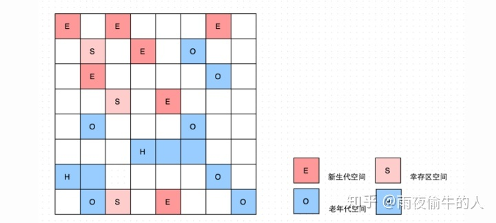

# 垃圾回收器

# Serial 
采用单线程进行gc，需要stw，针对新生代采用copy算法，将s1中存活的对象挪动到s2中。几十M的内存应用可以使用，单线程消耗少。通常与Serial Old一起用。

# Serial Old
采用带线程进行gc，针对老年代采用标记-整理法，先标记回收对象，然后将存活对象整理到内存的一边，保证可用内存连续性，避免出现内存碎片。

# Parallel Scavenge （吞吐量优先）
用于新生代的多线程垃圾回收器，采用复制算法，会产生stw。parallel scavenge关注系统的吞吐量，可以通过-XX:+MaxGCPauseMillis控制gc尽量保持在n ms以内。代价是gc次数更加频繁。通过-XX:+GCTimeRatio控制gc时间的占比。

# Parallel old （吞吐量优先）
用于老年代的多线程垃圾回收器，采用标记-整理算法。

# parNew （与CMS匹配）
由于Parallel Scanvenge无法与CMS共用，所以基于Parallel Scanvenge优化初parNew，多线程垃圾回收器，采用复制算法。

# CMS （Concurrent Mark Sweep）
[相关文章](https://mp.weixin.qq.com/s/vmnBlrM7pTtVuyQU-GTcPw)
以最短停顿时间为目标的多线程垃圾回收器，针对老年代采用标记-清除算法，会产生内存碎片，当内存碎片过多无法创建新对象时，产生fullGC, 会采用Serial Old单线程进行标记整理。默认老年代内存92%开始gc。

- 初始化标记（stw）：从GC roots出发，将所有可达对象标记为灰色。默认单线程，支持多线程。
- 并发标记：将初试标记后的对象递归遍历，将对象设置为黑色，并且将其属性对象设置为灰色，直到没有灰色对象。由于并发标记不会stw，因此并发标记期间产生的引用变化，会将对象所在的card page设置为dirty。
- 并发预清理：扫描dirty Card Page中的对象，并恢复card page状态。
- 可中止的并发预清理（主要处理新生代产生的问题）:
    1、处理 From 和 To 区的对象，标记可达的老年代对象；
    2、和上一个阶段一样，扫描处理Dirty Card中的对象。
具体执行多久，取决于许多因素，满足其中一个条件将会中止运行：
    1、执行循环次数达到了阈值；
    2、执行时间达到了阈值；
    3、新生代Eden区的内存使用率达到了阈值。
- 重新标记（stw）：
    1、遍历新生代对象，重新标记；（新生代会被分块，多线程扫描）
    2、根据GC Roots，重新标记；
    3、遍历老年代的Dirty Card，重新标记。这里的Dirty Card，大部分已经在Preclean阶段被处理过了。
- 并发清理：清理所有垃圾对象
- 并发重置：重置gc中修改的所有数据，比如黑色对象。

# GC Roots
所谓“GC roots”，或者说tracing GC的“根集合”，就是一组必须活跃的引用。例如说，这些引用可能包括：
- 所有Java线程当前活跃的栈帧里指向GC堆里的对象的引用；换句话说，当前所有正在被调用的方法的引用类型的参数/局部变量/临时值。
- VM的一些静态数据结构里指向GC堆里的对象的引用，例如说HotSpot VM里的Universe里有很多这样的引用。
- JNI handles，包括global handles和local handles（看情况）
- 所有当前被加载的Java类（看情况）
- Java类的引用类型静态变量（看情况）
- Java类的运行时常量池里的引用类型常量（String或Class类型）（看情况）
- String常量池（StringTable）里的引用

# [Card Table](https://juejin.im/post/5c39920b6fb9a049e82bbf94)

- jvm中将内存划分为card Page, 每个card Page 512字节，每card page对应card Table一个下标, 用于标记card Page的状态（占1字节）。
- Card Marking: 用于跟踪老年代指向新生代对象的引用，避免minor GC时遍历老年代的对象。具体实现是使用Card Table和写屏障进行标记。
- 如何计算对象所在页，通过对象引用地址右移9位，相当于除以512。
- 无条件的写屏障会带来性能消耗，以及虚拟共享内存问题，这里涉及到cacha line。

# G1 Garbage First

G1将内存平均划分了N个Region，采用逻辑上的内存分代（物理内存不连续），默认2048