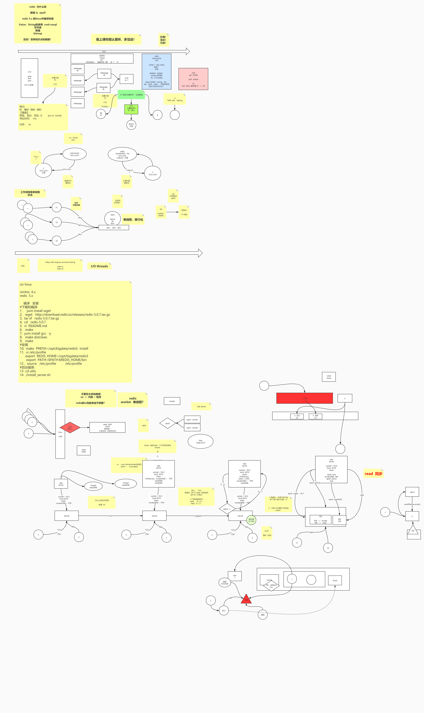

# Redis特性
1、单线程处理模型，采用了非阻塞的异步事件处理机制epoll，缓存数据都是内存io操作，为ns级别，单线程避免线程上下文切换。6.x以前是非阻塞同步io处理，通过epoll监听内核事件，主线程执行对应系统调用。6.x是非阻塞异步io处理，通过epoll监听内核事件，开辟io线程负责读写数据，主线程负责纯cpu计算。
2、value有string、list、set、zset、hash等五种类型且有自己的本地方法
3、速度快，分布式缓存，10w+/s
5、支持持久化，可用作nosql数据库，日志形式
6、Redis提供主从同步机制，以及 Cluster 集群部署能力，能够提供高可用服务

# 应用场景
## string
- 数据缓存，分布式锁
- 计数器
- 共享session

## hash
- 对象，前提的无嵌套对象

## list 双向链表
- 粉丝列表、文章评论列表
- 消息队列Lpush，阻塞队列BRpop

## set
- 分布式去重
- 交集、并集、差集，共同好友，朋友圈

## zset 分越小排越前
- 底层通过map+跳表实现
- 排行榜
- 优先队列

## bitmap setbit
- 签到

## lua脚本

## pub/sub
- 消息队列

## Pipeline
- 批量执行一组指令，减少io

# 事务
Redis 提供的不是严格的事务，Redis 只保证串行执行命令，并且能保证全部执行，但是执行命令失败时并不会回滚，而是会继续执行下去。可以通过watch监听某个key，当k-v发生变化时，事务失效。

# 持久化
Redis 提供了 RDB 和 AOF 两种持久化方式，RDB 是把内存中的数据集以快照形式写入磁盘，实际操作是通过 fork 子进程执行，采用二进制压缩存储；AOF 是以文本日志的形式记录 Redis 处理的每一个写入或删除操作。

- RDB 持久化机制，是对 Redis 中的数据执行周期性的持久化。
- RDB 把整个 Redis 的数据保存在单一文件中，比较适合用来做灾备，但缺点是快照保存完成之前如果宕机，这段时间的数据将会丢失，另外保存快照时可能导致服务短时间不可用。 
- RDB采用Copy on write，写入的时候修改redis-server的逻辑地址到新的内存空间，不影响fork出来的RDB进程

- AOF 对日志文件的写入操作使用的追加模式，有灵活的同步策略，支持每秒同步、每次修改同步和不同步，缺点就是相同规模的数据集，AOF 要大于 RDB，AOF 在运行效率上往往会慢于 RDB。
- AOF 机制对每条写入命令作为日志，以 append-only 的模式写入一个日志文件中，因为这个模式是只追加的方式，所以没有任何磁盘寻址的开销，所以很快，有点像Mysql中的binlog

# 过期策略
- 定期删除，随机抽取一些设置了过期时间的key，检查是否过期，过期则删除。
- 惰性删除，部分key长时间没有被随机抽取到，再次访问时，会检查过期时间，过期则删除。

# 淘汰策略

- no-enviction（驱逐）：禁止驱逐数据，返回错误

- allkeys-lru：回收最少使用键

- volatile-lru：从已设置的key集合中回收最少使用键

- allkeys-random：随机回收key

- volatile-random：从已设置的key集合中随机回收key

- volatile-ttl：回收过期集合的key，优先回收ttl较短的key

# LRU

# 高可用

# 数据一致

# 缓存穿透
大量请求无法命中cache，直接压到db。（布隆过滤器）

# 缓存雪崩

# 分库
- 一致性hash https://zhuanlan.zhihu.com/p/34985026